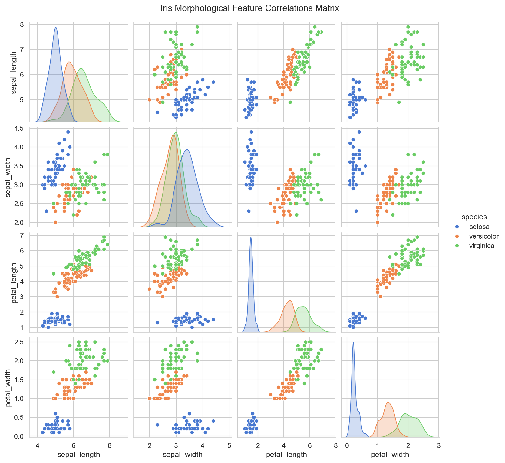
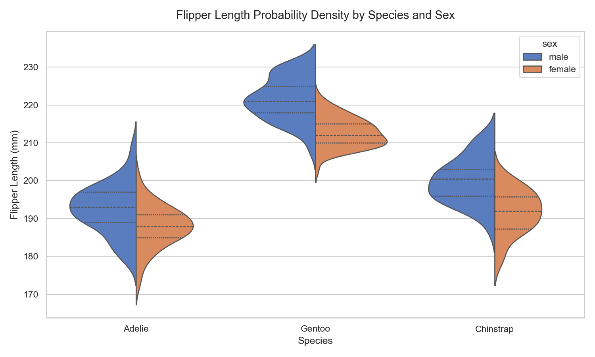
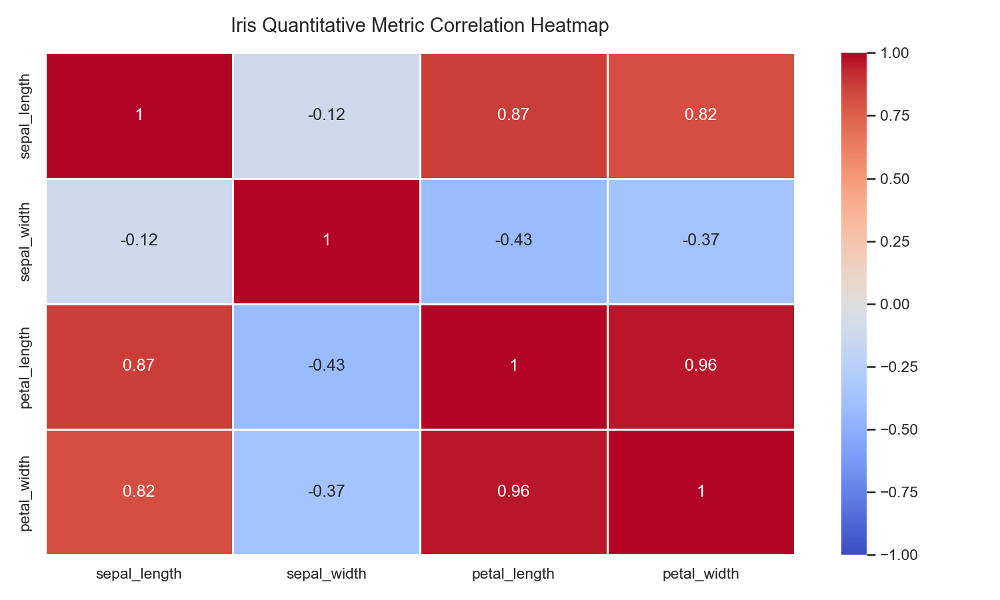

## Data Selection

Here is where you will talk about what data sources you selected, and why. How do they pertain to your research questions? Was this the best data available? 

## Data Acquisition

Here is where you will talk about HOW you acquired your data. Detail any APIs used, any websites accessed, or any directories downloaded

## Data Cleaning

Here is where you will discuss how you cleaned, engineered, or otherwise adjusted any of the data from the Acquisition stage. 

## EDA

Here is where you can include any exploratory data analysis (EDA) you performed on your data. You can include any visualizations, summary statistics, or other analyses you performed to better understand your data. Make sure to include any relevant code snippets, and explain what you learned from your EDA.

